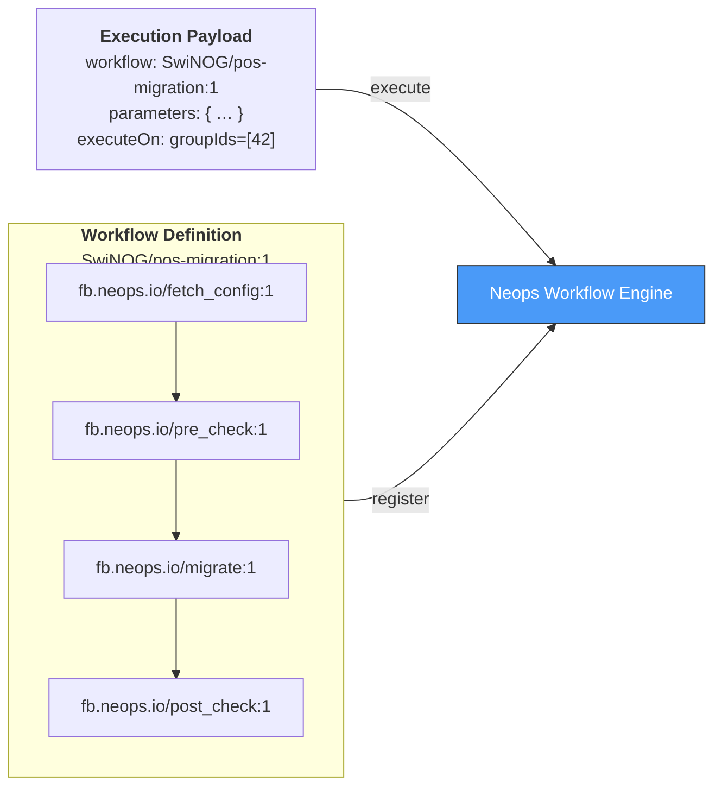
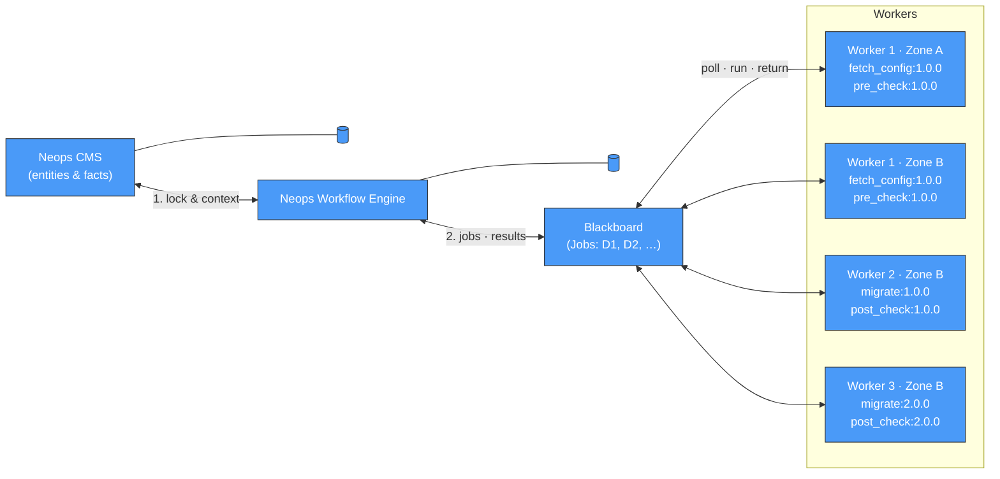

# System overview

A workflow run has two sides: **what you author and trigger** (a workflow definition plus an execution payload) and **what happens at runtime** (the engine, CMS, blackboard, and a pool of workers).
The two diagrams below cover each side in turn — start with the first to see what the platform asks you to write, then read the second to see what it does with it.

## 1. Authoring and triggering

A workflow definition is an ordered list of versioned function-block references — no Python, no host configuration, no scheduling logic.
To run one, a caller posts an execution payload that names the workflow and the entities to operate on; the engine takes it from there.

## 2. Runtime architecture

When the engine receives an execution payload it acquires entity locks from the CMS, posts jobs to the blackboard, and waits for workers to pick them up.
Each worker advertises the function-block versions it implements, so several versions can coexist during a rolling upgrade without taking the engine down.

## What to notice

- **The engine acquires entities before any worker runs.**
  Locking is centralized at the CMS, not distributed across workers, so a single workflow run sees a consistent snapshot.
- **The blackboard decouples the engine from worker placement.**
  Workers poll for jobs they can handle; the engine never knows or cares which physical worker runs a given step.
- **Workers can advertise different function-block versions.**
  Worker 2 runs `migrate:1.0.0` alongside Worker 3 on `migrate:2.0.0` — this is how rolling upgrades work without engine downtime.

## See also

- [How Neops operates](20-how-neops-operates.md) — sequence diagrams for the read path, write path, and full execution flow.
- [Workflow Engine concepts](../neops-workflow-engine/docs/10-concepts/index.md) — definitions, transactions, blackboard, execution model.
