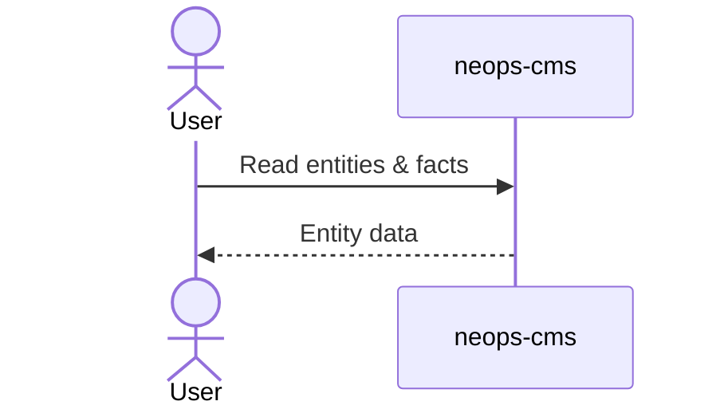
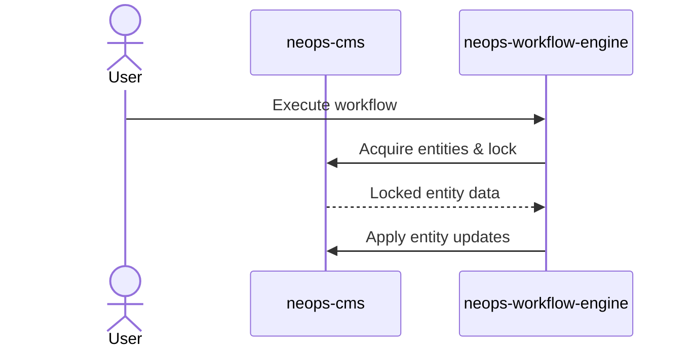
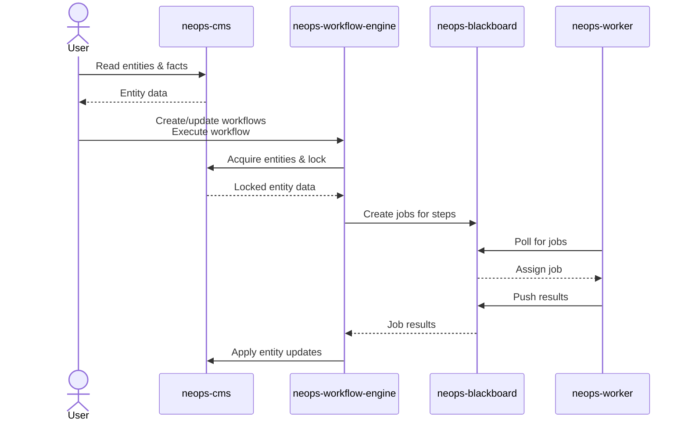

# How Neops operates

Neops separates data management from workflow execution. The CMS is the source of truth
for entity data, while the workflow engine orchestrates changes as workflows and
persists execution state. Workers run the actual function blocks and communicate
through the blackboard, which is the engine's job queue.

The blackboard is implemented inside the workflow engine (database tables + REST
endpoints). Workers poll it for jobs and push results back.

## Core components

- User: Reads entity data and triggers workflows.
- neops-cms: Stores entities and exposes them via APIs.
- neops-workflow-engine: Orchestrates workflows and manages execution state.
- neops-blackboard: The job queue used by the engine and workers.
- neops-worker: Executes function blocks and reports results.
- database: Persists workflow executions, jobs, and results.

## Overview: Read path (User ↔ CMS)

## Overview: Write path (Workflow execution)

## Execution flow (Engine, Blackboard, Worker)

## See also

- [System overview](10-overview.md) — the same architecture as a single dataflow diagram.
- [Workflows as transactions](../neops-workflow-engine/docs/10-concepts/40-workflow-as-a-transaction.md) — what locking, atomic updates, and failure classification actually guarantee.
