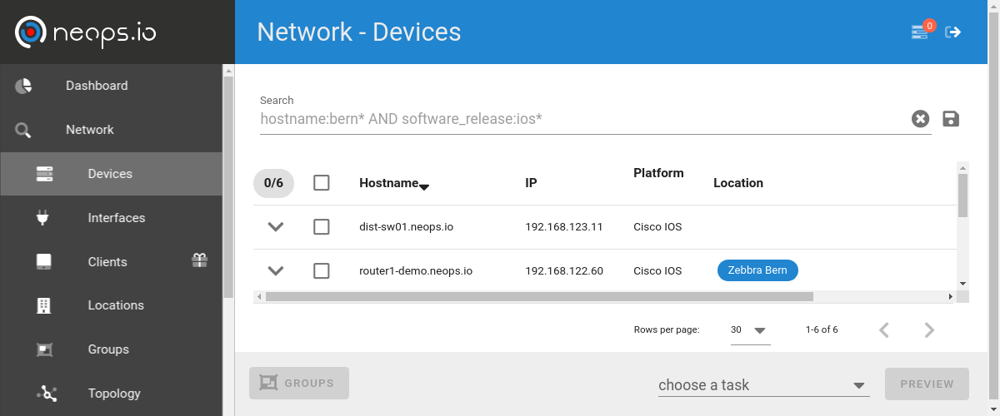
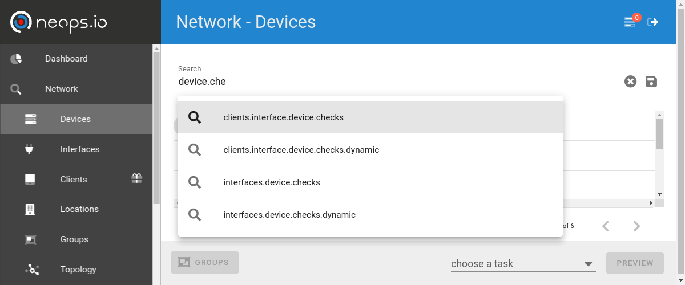
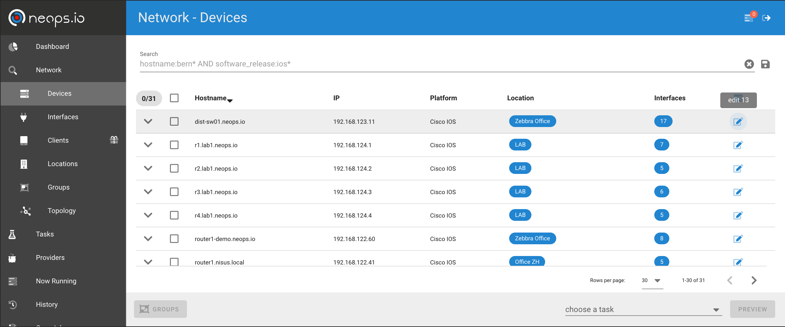
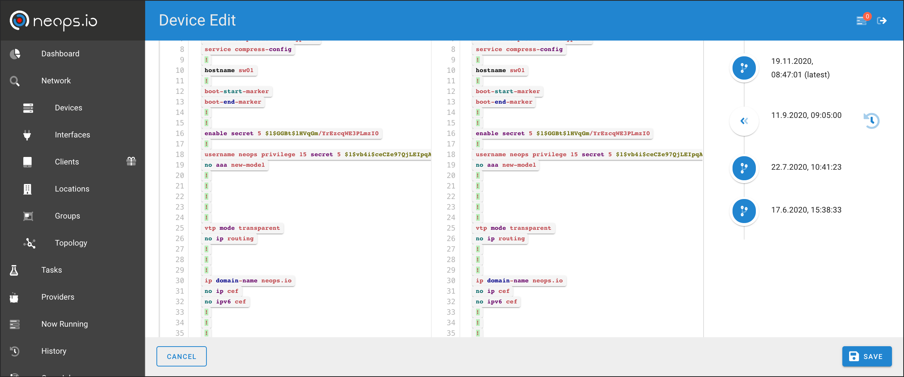
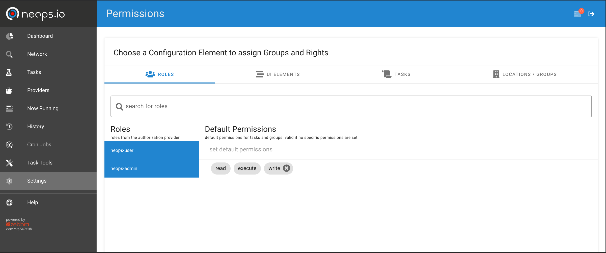
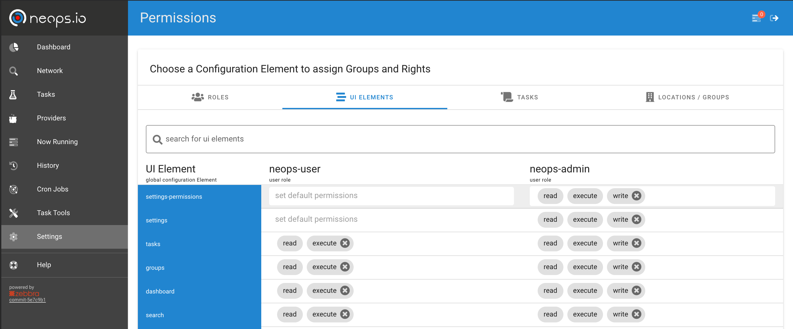
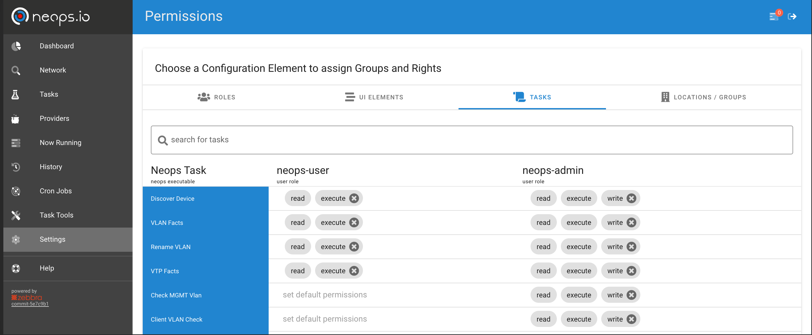
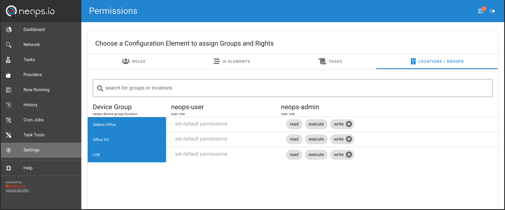

# Usage

## Network Search

The network search view gives you an overview over the entities `Location/Group`, `Devices`, `Interfaces` and `Clients` (see [Entities](35-architecture#entities)). All three views display the search related elements. In addition, the topology of the searched network elements is displayed.



Relevant data regarding the entities (facts, checks and global data) is searchable via the search bar.



### Search Terms

Search terms are composed by [key]: [value] and put together by the logical operators AND/OR (optionally NOT).
Or additionally full text searches are possible as well.

#### Keys

Possible keys are suggested. They are composed hierarchically over the full data structure. For example if you have [facts](/factss) on devices stored under the key of VLANs like the following:

```json
  "vlans": [
    {
      "name": "default",
      "status": "active",
      "vlan_id": "1",
      "interfaces": [
        "Gi0/1",
      ]
    },
    {
      "name": "MGMT",
      "status": "active",
      "vlan_id": "10",
      "interfaces": [
        "Gi0/1",
        "Gi0/2"
      ]
    },
    {
      "name": "CLIENT-A",
      "status": "active",
      "vlan_id": "100",
      "interfaces": [
        "Gi0/1",
        "Gi3/0",
        "Gi3/1"
      ]
    },
    {
      "name": "CLIENT-B",
      "status": "active",
      "vlan_id": "101",
      "interfaces": [
        "Gi0/1",
        "Gi3/2",
        "Gi3/3"
      ]
    },
  ],
```

You are able to filter the elements where one device has VLAN XY configured by using the key `devices.facts.vlans.name` (`devices` = access to the device elements, `facts` = access to the facts of the device, `vlans` access to the facts key, `name` key within the facts).

Then, the search term to get all elements where VLAN `CLIENT-A` is configured will be `devices.facts.vlans.name: CLIENT-C`

If you are on the interface view, with this search all interfaces of the filtered devices are show. But this is probably not what you want.
To search only the interfaces where the specific VLAN is configured, then you need more specific information, like VLAN facts on the interfaces.
As an example on Interface `GigabitEthernet0/1`:

```json
  "vlans": [
    {
      "name": "default",
      "status": "active",
      "vlan_id": "1",
    },
    {
      "name": "MGMT",
      "status": "active",
      "vlan_id": "10",
    },
    {
      "name": "CLIENT-A",
      "status": "active",
      "vlan_id": "100",
    },
    {
      "name": "CLIENT-B",
      "status": "active",
      "vlan_id": "101",
    },
  ],
```

Or on `GigabitEthernet3/1`:

```json
  "vlans": [
    {
      "name": "CLIENT-A",
      "status": "active",
      "vlan_id": "101",
    },
  ],
```

With the interface related search term `interfaces.facts.vlans.name: CLIENT-A` you will get interfaces Gi0/1, Gi3/0 and Gig3/1. And in device and location view, you'd get the related devices or locations with interfaces that match the above search.

#### Values

A `*` can be uses as a wildcard.
For exact matches use double quotes `"`.

Strings within facts in a key name with `ip` in it, are tried to be stored as ip addresses. This gives you the ability to search within ip addresses in a subnet. Entering the network and subnet length in double quotes like `"192.0.2.16/28` will give you all elements that contains a ip address in the range 192.0.2.16 - 192.0.2.31 in the result set.

#### Operators

Operators `AND`, `OR` and `NOT` have to be uppercase. Parentheses can be used for logical ordering.

#### Ressources

[elastic query string search documentation](https://www.elastic.co/guide/en/elasticsearch/reference/current/query-dsl-query-string-query.html)

### Saved Searches

To easily reuse complex search terms, you can save and name them with the disk sign on the right.

To find the saved search term, enter the defined name. Saved searches are per default added in front of the term with the `AND` operator added.

# Execute/Create Tasks

see [tasks](/20-tasks)

# Tasks of Implemented Providers

see [tasks](/20-tasks), [providers](/25-provider) and [provider overview](/30-provider_overview)

# Configuration History and Rollback

The [Discovery Provider](/pdoc-md/neops.core.provider.device_discovery) saves the configuration for Devices and Interfaces to neops.

The Configuration History can be accessed over the Device List and the Edit Button



The you have an overview of the saved configurations and the ability to compare them.



To Rollback a Device to a given state push the time backwards button, the device will be set to the state of the configuration on the right side.
The Rollback operation is performed by the [Device Rollback Provider](/pdoc-md/neops.core.provider.device_rollback)

!> use this functionality with caution

# Authentication, Roles, Rights and Permissions

## Authentication

neops.io supports 3 different Authentication Providers:

- no Authentication
- Authentication against Local User Database (Django)
- Authentication against Keycloak, with OAuth2.0 (Backends like Oauth, LDAP and others supported by [Keycloak](https://www.keycloak.org/))

## Roles, Rights and Permissions

neops.io has it's own permission system. We grant access based on roles (Role assignments are set in Keycloak or in the Local User Database).
Roles are linked to Tasks and Device Groups with three different type of permissions (Read, Execute, Write). Those Permissions are implicit as soon you have write permissions to an element you will have permissions to read and execute as well.
That a user is able to execute or modify a Task on a given Device he need at least execute or write permission on both Elements with any given role.

To grant access to permission management or other functionality there are dedicated permission elements to grant access on (such as can a user create a task).

### Permission Management

To edit permissions go to Settings -> Permissions.

#### Role Permissions



In the first tab you have all existent roles with their default permissions if a element (Task, Device Group or Permission Element) does not have an explicit set permission the default permission are set.
With those default permissions you have the ability to go with the least privilege principle (no default permission) or not (set default permissions)

#### Permission Elements



To grant access to task creation, permission settings or any other base functionally use the "UI Elements" tab.
The needed permission (read, write, execute) for an action is related to the implementation. But basicity it should be self explained such as for the permission settings only read and write are used.

Those permissions are always related to roles.

#### Permission on Tasks



Grant access to a task, read, execute or edit (write) the task.

Those permissions are always related to roles.

#### Permission on Device Groups



Grant access to a Device Groups, Devices, Interfaces and Clients.
As soon as a Device is in a permitted Device Group for a given role, those person has access to any Device related Interfaces or Clients as well.

Those permissions are always related to roles.
