# Tasks

neops.io tasks are performing actions (collecting facts, make changes, interact with peripheral systems).

There are currently 4 types of tasks implemented

- CONFIGURE - _configure network devices_
- FACTS - _collecting facts_
- CHECK - _check states based on facts_
- EXECUTE - _generic task for troubleshooting purpose, interact with peripheral systems (if it's not related to facts) or others_

All Tasks are based on [providers](#providers) that execute the tasks. A task is a parameterized provider instance.

A task passes the required configuration (parameterized) to a provider to make it runnable. These requirements are defined in a providers [json schema](/appendix_sub/appendix_jsonform). A list of the providers and their required configuration json schema is [here](/30-provider_overview).

**A check is a task, which does not manipulate the network state in any way.**

## Create new task or check

To create a new task navigate to the task menu in the main navigation and click on **create**.

---

The task form consists of general task fields and specific fields depending on the provider (read more on how to to create your own provider and add form fields using JSON Form)

<!--  -->

<!--  -->

---

After saving the task, it will appear in your task list.

## Execute Tasks

Navigate to your network, and select the elements you want to run the task on.

Select the task in the bottom bar and click on **preview**. Enter a description for the process and start.

You can learn more about how network elements are resolved in the provider section.

Depending on the options set within the provider it is possible that it is supported to run from all entities or only from one entity. For example if you have a configure task on a interface, it's better you select only the target interfaces than select a device group and run the task on all interfaces of the devices in this device group. For more information see the [provider properties](/25-provider?id=properties).

## Task parameters

Task parameters are used to describe the task itself and how it is acting.

General task parameters are available in each task. Fields written in **bold** are mandatory.

| Field                  | Description                                                                                              |
| ---------------------- | -------------------------------------------------------------------------------------------------------- |
| **Name**               | A human readable name for the task                                                                       |
| Description            | A human readable description for the task                                                                |
| Unique task identifier | Can be assigned to use the task over our API                                                             |
| Run Filter             | Additional filter, using the elastic query style                                                         |
| **Provider**           | The provider (will expand the form with dynamic parameters from the provider)                            |
| Pre run tasks          | Tasks which have to run before this task (see [task graph](./usage_tasks_graph.md) for more information) |
| Post run tasks         | Tasks which have to run after this task (see [task graph](./usage_tasks_graph.md) for more information)  |

### Additional input parameters (JSON scheme for running the task)

Providers describe additional input parameters as [JSON Schema](https://json-schema.org/learn/getting-started-step-by-step.html). They are required to run a task.

When creating a task, a web Form is rendered based on the task JSON schema to get the required input values.

For more information how to build such a JSON Schema look in [Appendix under JSON Form](40-appendix#json-form)

## Pre and post running tasks (task graph)

For some tasks, like configurations or checks, it's essential to have accurate (actual) data. They are based on current facts or states, which should be collected in front of the task. Such supporting tasks can be referenced as pre- or post-running tasks

Neops tasks can be combined and reused in other tasks by setting them as a **pre run** or **post run** task. The task resolver will then find a valid sequence to run the tasks.

### Task sequencing

Consider the case where you want to run two tasks, and perform an integrity check after each.

#### Independent tasks

If the tasks are completely independent, you may run them independently:

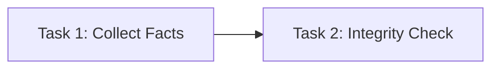

And

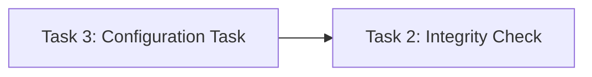

#### Dependent tasks

However, if you have dependencies between 2 or more task, you can specify pre and post run tasks accordingly.

Here, a dependency of task 1 and task 2 is configured by setting task 1 as a pre run task of task 2.

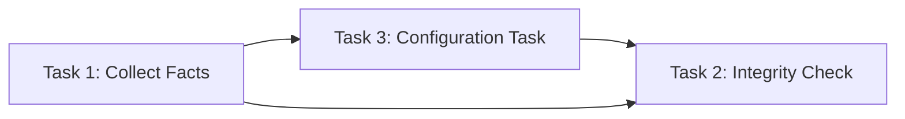

Which will be sequenced by the task resolver as following:

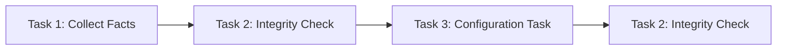

#### Optimize task sequence

##### Removal of consecutively repeating tasks

Consider an example with pre and post run tasks, similar to the previous. Here, a pre run task is added to task 1 and 2, such that the integrity check is mandatory before a change can occur:

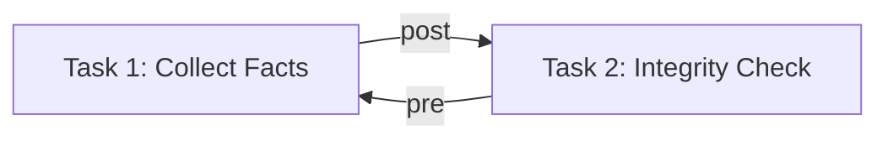

which expands to:

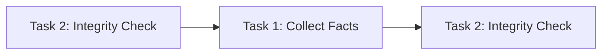

And

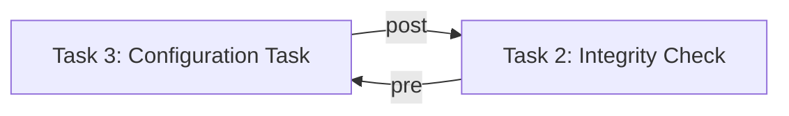

which expands to:

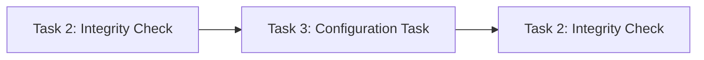

Setting Task 1 as **pre run task** of Task 2, the following task graph is produced:

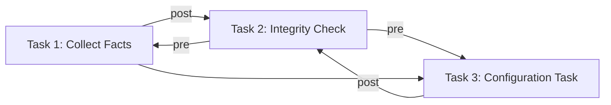

which expands to:

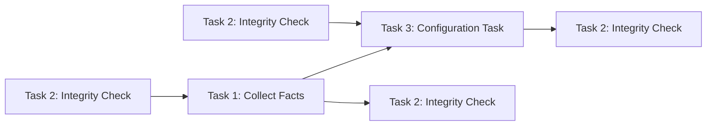

In this example, a sequencing would result in performing the **integrity check** two times in a row (as we have 2 tasks and 4 integrity checks):

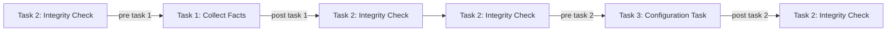

Here, the sequence is optimized, such that no duplicates exist and task definition is fulfilled.

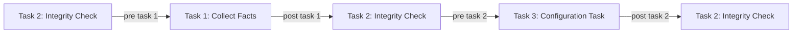

##### Optimize task sequence by finding shortest path

Consider the previous example with an added post run task (task 4) to task 1. Task 4 has no dependencies.

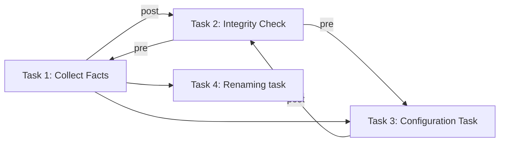

Here, a second possible path fulfilling the requirements is introduced. Neops will find the task sequence which is shortest.

6 Task executions (shortest)

```mermaid
graph LR
    A1[Task 1: Collect Facts]
    A2[Task 3: Configuration Task]
    A3[Task 4: Renaming task]
    C11[Task 2: Integrity Check]
    C12[Task 2: Integrity Check]
    C22[Task 2: Integrity Check]
    C11 -- pre task 1 --> A1
    A1 -- post task 1 --> C12
    C12 -- pre task 2 --> A2
    A2 -- post task 2 --> C22
    C22 -- post task 1 --> A3
```

7 task executions (not shortest)

```mermaid
graph LR
    A1[Task 1: Collect Facts]
    A2[Task 3: Configuration Task]
    A3[Task 4: Renaming task]
    C11[Task 2: Integrity Check]
    C12[Task 2: Integrity Check]
    C22[Task 2: Integrity Check]
    C21[Task 2: Integrity Check]

    C11 -- pre task 1 --> A1
    A1 -- post task 1 --> C12
    C12 -- post task 1 --> A3
    A3 -- post task 1 --> C21
    C21 -- pre task 2 --> A2
    A2 -- post task 2 --> C22
```
