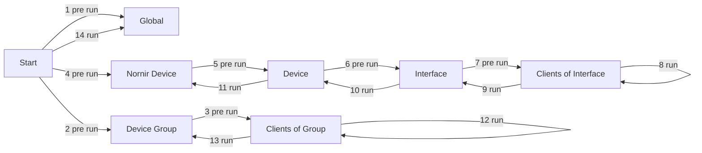

# Providers

Providers are the classes used by tasks. They provide functionality and expose configuration parameters through JSON Forms to the user. Providers are running the tasks.

This way, a provider can be written (like a function) in a generic and reusable way, while a task contains configuration which is passed to the provider.

Neops comes with a set of providers out of the box, see [built in providers](30-provider_overview).

## Tasks

Tasks are instantiated Providers given arguments they can be executed from the frontend with additionally passed arguments.

To execute a task those arguments can be used:

- `neopsTaskId` or `uniquetaskname`: _id or the unique name of the task to execute_
- `executeOn`: _list of id on which elements the task should be performed (this list can be empty, see [properties](#properties))_
- `executeOnType`: _on which entity the task should be performed (see run_on_strict in [properties](#properties))_
- `dryRun`: _option if there should be no change on the device/api itself, has to be implemented by the used provider_
- `taskArguments`: _additional run arguments for the task (see run_input_json_schema in [properties](#properties))_

example GraphQL call

```
mutation neopsTask {
  neopsTaskExecute (neopsTaskId: 1, executeOn: [1], executeOnType: DEVICE, dryRun: true, taskArguments: "{}") {
    execution {
      id
      state
      neopsTask {
        id
        name
      }
    }
  }
}
```

## Properties

They have some base properties that describe the provider.

On which entity and how the provider has to be executed:

- `run_on`: _the task is executed on this entity_
- `run_on_strict`: _describes the allowed input entities, if strict only elements of the run_on entity are allowed, otherwise the run_on entity is resolved from the given entity (eg. interface 1,2 belongs to device A, interface 3,4 belongs to device B. if run_on is set to DEVICE and run_on_strict is False: interface 1 is given the task runs on device A. vice verca if run on is set to INTERFACE and run_on_strict is False: device B is given the task runs on interface 3 and 4. if run_on_strict is True only run_on entity is supported)_
- `run_on_all_if_empty`: _use with caution_ - _runs on all elements if none is given (mostly used for facts providers)_

```python
run_on = RunOnEnum.DEVICE
run_on_strict = True
run_on_all_if_empty = False
```

Properties to describe the provider/task:

- `provider_type`: _representing the four different [task](#tasks) types_
- `description`: _describe what the provider will do_

```python
provider_type = ProviderTypeEnum.FACTS
description = ""
```

Properties to describe which input parameters are required for the task instance and in the runs:

- `json_schema`: _[JSON Form](40-appendix#json-form) for rendering the task instance form in the frontend_
- `run_input_json_schema`: _[JSON Form](40-appendix#json-form) for rendering the form before the task runs_

```python
json_schema = {}
run_input_json_schema = {}
```

## Run cycle

The run cycle definition is implemented in each neops provider. Steps can be left empty, but the order is immutable.

Use **pre run** and **run** steps to prepare and execute.

| #   | Step                            | Description                                                                                                                 |
| --- | ------------------------------- | --------------------------------------------------------------------------------------------------------------------------- |
| 1   | Pre run on global               | All task arguments are passed                                                                                               |
| 2   | Pre run on device group         | Per device group. Device groups are resolved and passed                                                                     |
| 3   | Pre run on clients of group     | Per client of group. Runs in context of group (here, groups are locations). Device group and client are resolved and passed |
| 4   | Pre run on nornir device        | Per nornir device. Nornir device is resolved and passed                                                                     |
| 5   | Pre run on device               | Per device. Device is resolved and passed                                                                                   |
| 6   | Pre run on interface            | Per interface of device. Device and interface are resolved and passed                                                       |
| 7   | Pre run on clients of interface | Per client of interface. Device, nornir device an dinterface are resovled and passed                                        |
| 8   | Run on clients of interface     | Run equivalent for #7                                                                                                       |
| 9   | Run on interface                | Run equivalent for #6                                                                                                       |
| 10  | Run on device                   | Run equivalent for #5                                                                                                       |
| 11  | Run on nornir device            | Run equivalent for #4                                                                                                       |
| 12  | Run on clients of group         | Run equivalent for #3                                                                                                       |
| 13  | Run on device group             | Run equivalent for #2                                                                                                       |
| 14  | Run on global                   | Run equivalent for #1                                                                                                       |



For more information of the methods of the run cycle see the [BaseRunCycle](Neops Provider Overview/neops.core.provider.base.base_run_cycle) class.

## Result handling

Results are handled per default by the [BaseResultWriter](Neops Provider Overview/neops.core.provider.base.base_result_writer) it stores the results to the database and informs the user. For preprocessing of the results. At the end of the run cycle are the methods of - [BaseProcessResultCycle](Neops Provider Overview/neops.core.provider.base.base_process_result_cycle) called. Those methods are here to modify results based on other results or use them to save information to the database like the base fact or base check provider does.

Result Objects are generated for every related element of a task run. Within this objects the relation between elements of the entities is represented. If a task step in the [run cycle](25-provider?id=run-cycle) fails (by an exception or set on the result object), the element itself and none of it sub elements are further processed. For example if it's unable to connect to a device no more run cycle methods related to this device (device, interfaces and clients on interfaces) are processed.

## Inheritance

For new providers inheritance from the [base providers](/30-provider_overview?id=base-providers) is _required_ they brings the base functionality how a provider is executed, result handling and basic configuration, facts or check handling.
