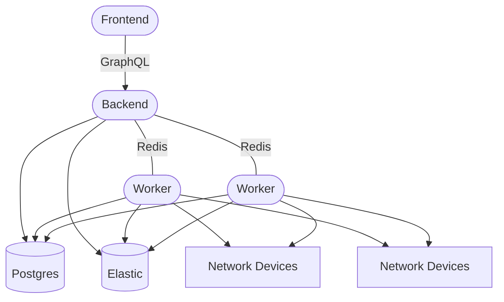
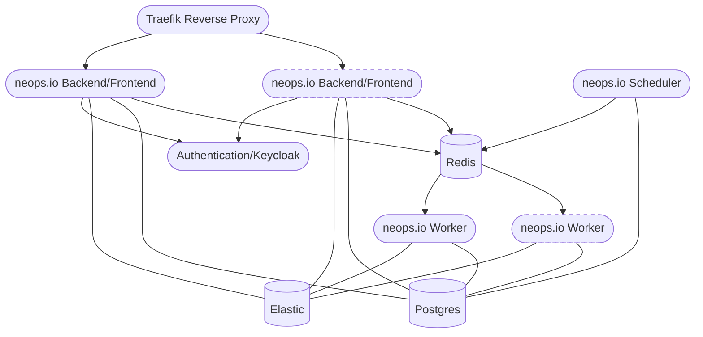
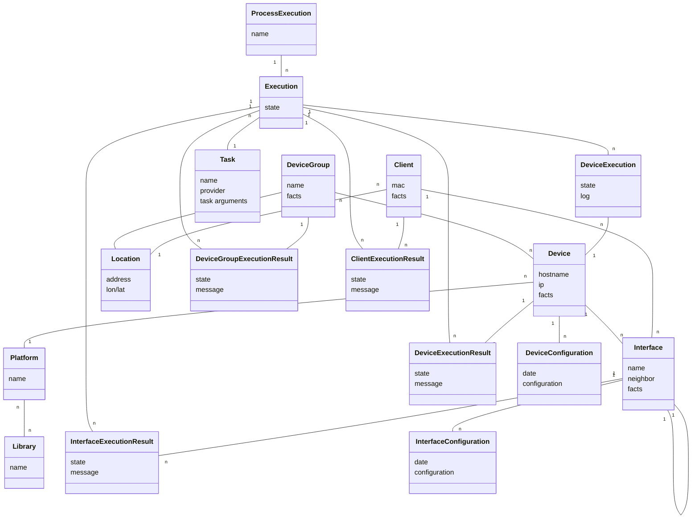

# Architecture

## Principles

neops.io as a network automation software was built with the following principles in mind

- network engineers know their network best, so network design and logic of tasks/todo’s are in their responsibility
- neops.io itself has no, or as minimalistic as possible, knowledge of the network and the functionality of its devices. Information and logic about the network is brought to neops.io by tasks that are collecting information from the network or external systems.
- Facts are a central element in neops.io. They are the base upon to build the logic of tasks to deploy changes in the network
- neops.io should bring flexibility to implement functionality at different levels
  - device level: change the methods of how to read and write from network devices to fit your vendors and your needs
  - provider level: bring your own task providers to implement APIs of your peripheral systems or bring new features (like AI ;)) to neops.io
  - task level: define the todo in your network within your tasks, so they will represent the prerequisites of your network
  - permission, workflow level (planned) and triggers (planned): easy automate or delegate tasks

## Services

### Logical application overview

### Containers

We ship one container with different functionality. Frontend (VueJS) and Backend (python) are packed in one container.

Depending on its start parameters the neops.io container runs as:

- Frontend/Backend
- Worker
- Scheduler

neops.io depends on external ressources/services/containers:

- [Redis](https://redis.io/) - _message brocker between backend/worker/scheduler_
- [Postgres](https://www.postgresql.org/) - _relational database_
- [Elastic Search](https://www.elastic.co/elasticsearch/) - _search database_
- [Keycloak](https://www.keycloak.org/) - _authentication service_

### Scaling/Redundancy

neops.io has all its persistent data in the database, so neops.io containers can be easily run in parallel for scaling reasons.

For scaling and/or redundancy setup of 3rd party applications (Postgres, Elastic Search, Redis and Keycloak) please refer to their documentation.

## Entities

In reference to network components neops.io is currently working with the following entities:

- Device Groups - _Entity to group devices_
- Devices - _Main entity to access network components_
- Interfaces - _Entity for interconnecting Devices_
- Clients - _Entity connected to the network_

Locations are Device Groups with additional properties like address and coordinates.

## Frontend

The frontend is build with [Vue.js](https://vuejs.org) and accesses the backend over a GraphQL API.

## Backend

Backend is based on Python and realized with [Django](https://www.djangoproject.com/), [Celery](http://www.celeryproject.org/) and [nornir](https://nornir.readthedocs.io/) as its main components.

### Models

most relevant database models:

#### Documents

DeviceGroup, Device, Interface and Clients including their facts are stored as separated Indexes in Elastic Search

### Workers/Celery

Celery is used for the Workers they are executing the neops.io [Tasks/Providers](/25-provider).
The workers have direct access to the databases. Scheduled tasks are distributed with a redis queue. To inform the Frontend about updated information GraphQL subscription updates are triggered over different redis queues.

### GraphQL API

All backend Operations are available over the GraphQL API. Testing and Documentation of the API is provided by [GraphiQL](https://github.com/graphql/graphiql) on your installation under `http(s)://NEOPS_URL/graphiql/`

### nornir/Tasks/Providers

see [provider](/25-provider)

## Style Guide

We use flake8 linting and black formatting in the backend and eslint in the frontend to style our code.
