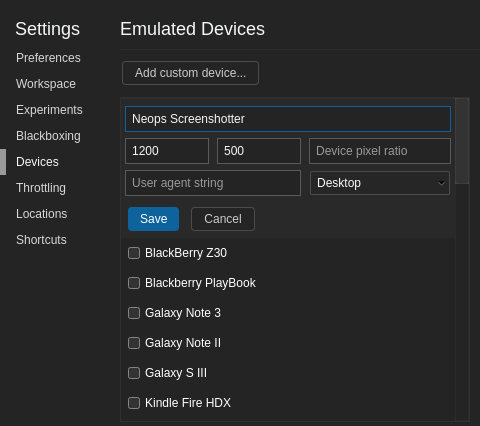
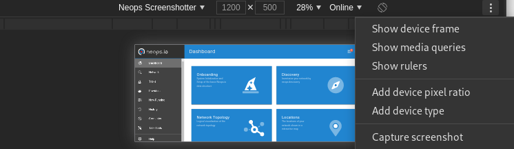

# Contribute to the docs

Thank you for contributing something to our documentation.

## Taking screenshots

Screenshots are taken in a standardized way for better reading experience.

To take a screenshot, please follow these points:

- Open Neops in a Chromium Browser
- Press F12 to open Dev Tools
- Press Ctrl+Shift+M to enable the device toolbar
- On the device menu, select **Edit...**
- Select Desktop and a resolution of 1200x500

- Capture a screenshot using the menu option **Capture Screenshot**

