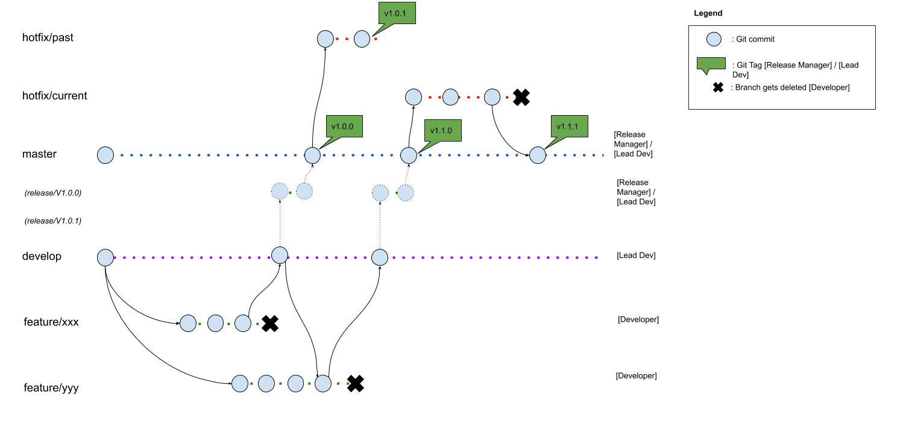

# Development

We use a light version of gitflow for development. Please refer to the image for more insight and check out [Gitflow documentation](https://www.atlassian.com/de/git/tutorials/comparing-workflows/gitflow-workflow). The Tool 'gitflow' is currently not used by us.

Key points:

- Tags represent releases and are normally on commits in the master branch. On hotfixes for past versions, the tags may not be available on the master branch.
- Master branch is stable, but not every commit has to result in a release.
- Development branch to integrate new features

