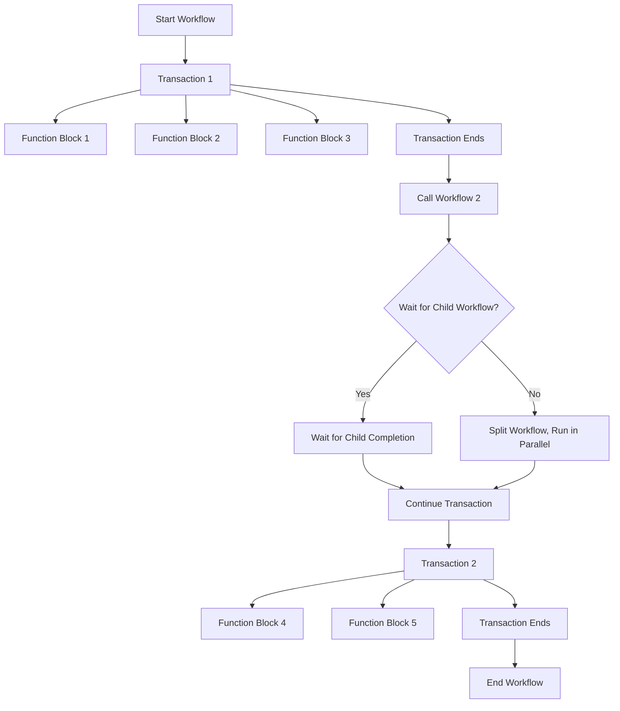

# Basic principles

## Store and Handle Facts
Using JSON-based data structures for facts of entities in a network automation platform brings several benefits. 
JSON is flexible, easily readable, extensibility, and scalable, making it perfect for representing complex network devices and configurations.

### Search Engine to Select Targets

In network automation, a search engine designed to query JSON-based facts is crucial for efficiently selecting the right entities to execute tasks or processes. It enables fast and accurate entity extraction, attribute matching, and filtering, ensuring that only relevant entities or facts are identified for automation workflows. This accurate entity selection reduces the complexity of logic implementation.

## Schema definitions
Using JSON Schema-based definitions for handling inputs in custom function blocks and tasks/workflows offers a powerful and flexible approach. By leveraging JSON Schema, we enable dynamic rendering of inputs for process execution, allowing the platform to automatically generate UI components based on the schema. This eliminates the need for manual intervention in the representation layer when introducing new function blocks.

The key benefit is that adding or extending the application with new function blocks becomes seamless, as the input handling and UI adjustments are driven directly by the schema. This approach ensures that the function logic can be updated or extended without any changes to the user interface or input logic, significantly reducing development overhead and ensuring a more agile and scalable automation environment.

## Everything is a transaction
In a network automation platform, treating everything as a transaction is key to ensuring integrity and tracking. Transactions guarantee that operations, in case of failure, leave the system in a consistent and reliable state. This approach enables the implementation of security concepts and minimizes race conditions by preventing conflicts when multiple tasks attempt to change states simultaneously, ensuring safe and controlled execution of automation workflows.

### Atomicity and rollback
Atomicity and rollback in a network automation platform are challenging, particularly when integrating with external systems through function blocks. Since we cannot always guarantee that remote systems support rollback functionality or ensure that changes are atomic, failures in those systems might result in incomplete or inconsistent states. This limitation means that while internal transactions within the platform can maintain atomicity and rollback, interactions with external systems require additional handling, such as implementing compensating actions or manual intervention to ensure consistency across systems.

### What is a Workflow or a function block
A workflow is a sequence of workflows or transactions, where each transaction can contain one or multiple function blocks. During the transaction's execution, read and write locks are used to ensure safe and consistent states, preventing conflicts between tasks. Typically, all function blocks within a workflow operate as part of a transaction. A transaction concludes when another workflow is invoked, with the option to either wait for the child workflow to complete or split and continue in parallel. This structure ensures controlled execution and state consistency throughout the process.



## my function blocks
In our system, you can extend functionality by creating custom function blocks, which are essentially simple workers (packaged as containers). Each worker utilizes the registration function provided by the NeOps SDK to offer its registered function blocks to the main system. This architecture allows seamless integration of custom logic into existing workflows.

When a custom function block is executed, the worker receives its own unique token. This token enables secure interaction with the NeOps CMS, allowing the worker to store data and interact with specific resources. The token also manages locking mechanisms, ensuring that the worker can only read from and write to a requested subset of data, enforcing a strict scope of operation. This ensures that locks are tied to the token and prevent unauthorized access to other parts of the system.

With this security feature, we ensure safe state management and proper handling of read/write operations, allowing multiple function blocks to operate in parallel without conflicts. Moreover, this setup enables customers to safely inject their own custom function blocks into the system, providing flexibility while maintaining security and integrity through token-based locking mechanisms.

This model allows the system to remain extensible and adaptable, as users can introduce new function blocks without compromising the security or stability of the platform.

## How is multi-vendor, multi-platform solved (move to funciton blocks?)
In a multivendor and multiplatform implementation, functions can be registered using a decorator that associates them with a specific vendor and model, in combination with the connection library. When a task is executed, the system resolves the correct function based on the most specific match (vendor, model), allowing for a flexible, extensible setup where general functionality can be customized for specific devices.

```python
@sdk.register_func(func="reload_device", conn="netmiko", vendor="Cisco", platform="xr")
def reload_device_xr(context, param1):
    #...

@sdk.register_func(func="reload_device", conn="netmiko", vendor="Cisco", platform="ios")
def reload_device_ios(context, param1):
    #...

@rsdk.register_func(func="reload_device", conn="netmiko", vendor="Cisco", platform="ios" model="C9300")
def reload_device_9300(context, param1):
    #...


## in function block
#...
reload_device(context)
#...
```

# Result handling, Context Storage, Logging
In our system, result states are tracked per entity and per function block. If a function block fails, the workflow can either stop or continue, depending on the defined logic and the result of the failure. A failure that impacts specific entities within a function block results in a "partial failure," while broader failures can affect the entire workflow. Importantly, there are no direct results returned from a function block; instead, we provide a context within the workflow where results from custom function blocks can be stored, and where facts about an entity can be persisted.

For logging, the system supports various log levels tied to entities, allowing users to filter logs based on specific entities or tasks. If an error occurs, whether per entity or across the whole task, exceptions are thrown with detailed information about the failure. Additionally, to enhance user interaction, we offer an option to stream log information at an "info" log level, keeping users informed about actions and steps being processed in real-time within the workflow.

This architecture ensures that failures are handled gracefully, results are captured and persisted contextually, and users have full visibility into the execution process through comprehensive logging and feedback mechanisms.


